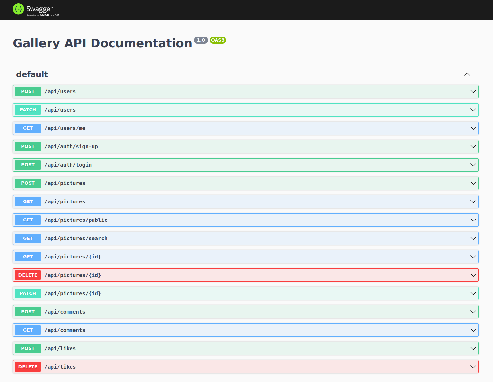

# Gallery backend #

TypeScript + Nest.js + PostgreSQL + TypeORM + AWS (Cognito, S3) + Swagger





### .env.yml ###

```
APP_PORT: 4000
DB_USER: postgres
DB_PASS: postgres
DB_NAME: gallery
DB_PORT: 5455
AWS_REGION: eu-central-1
AWS_COGNITO_USER_POOL_ID: eu-central-1_xxxxxxxxx
AWS_COGNITO_CLIENT_ID: xxxxxxxxxxxxxxxxxxxxxxxxxx
S3_BUCKET_NAME: xxxx
DEFAULT_AVATAR_URL: https://xxxx.s3.eu-central-1.amazonaws.com/avatars/default.jpeg
```